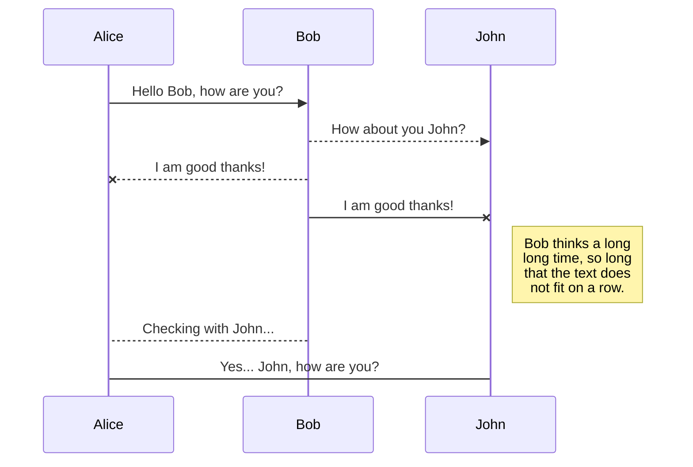
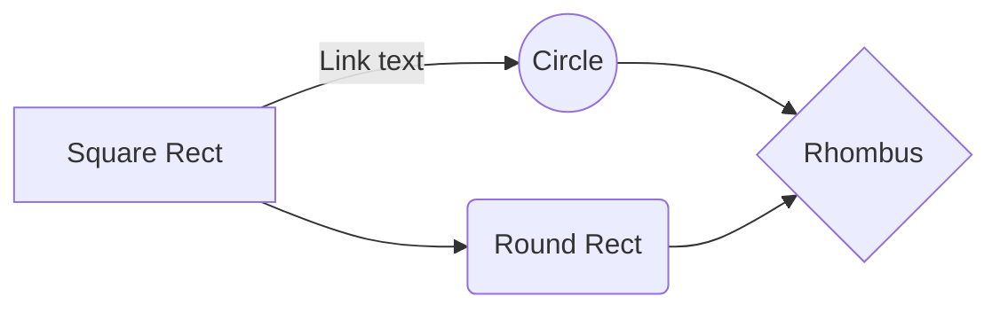

# Welcome to MILF

Hi! I'm your  **MapleStory** macro. 
 **Milf is good** .

# Installation

**pyqt5**

pip install pyqt5

**cv2**

pip install opencv-python

**win32api**

pip install pypiwin32

**pil**

pip install pillow

**serial**

pip install pyserial

**discord**

pip install py-cord==2.0.0b5 **or** pip install -U git+https://github.com/Pycord-Development/pycord

**tensorflow**

pip install tensorflow-gpu

**arduino**

https://www.arduino.cc/en/software

# Reference

**pycord to use the discordBot**

https://docs.pycord.dev/en/master/#getting-started

 **Arduino keyboard modifiers**
 
https://www.arduino.cc/reference/en/language/functions/usb/keyboard/keyboardmodifiers

**keyboard test**

https://funkeys.co.kr/bbs/page.php?hid=keytest

# How to use

that`s simple

## start
- python3
> main.py

시작 button : start
중지 button : stop , have to press a lot
불러오기 button : call the script

# config.ini

## Basic

Start with information

## Set

**기본동작모드** : basic operation

**스크립트제작** : Used when making hunting scripts
>rune check does not turn on
>discord does not turn on

## Debug

**룬찾기**button : Find the deep learning runes

## Capture set

| [Capture]  | Descriptions  |
|--|--|
| **캡쳐주기** | capture cycle , 0.1~9.9 |
| **메이플체크** | will you find the process |
| **미니맵체크**  | will you find the minimap  , dependent on **메이플체크** |
| **위치체크**  | location check , dependent on **미니맵체크** |
| **룬체크** | rune check , dependent on **위치체크** |
| **룬딥러닝** | rune answer with deep learning , dependent on **룬체크**  |

## Script set

| [Script]  | Descriptions  |
|--|--|
| **아두이노 사용** | use arduino |

## Discord set
| [Capture]  | Descriptions  |
|--|--|
| **디코봇 사용** | capture cycle , 0.1~9.9 |
| **디스코드 토큰** | discordBOT tokken |
| **디스코드 채널** | use discord channel ID |
| **디스코드 유저**  | use discord user ID |

>https://discord.com/login?redirect_to=%2Fdevelopers%2Fapplications

>
>copty to TOKKEN
>copy to URL
>
>
>

# todo

Todo

- ver 1.0  
	> ~~basic functions~~
- ver 2.0
	> Discord Notifications
	> lie detection Notifications
- ver 3.0
	> not yet

## UML diagrams

not yet sequence diagram:

not yet flow chart:

